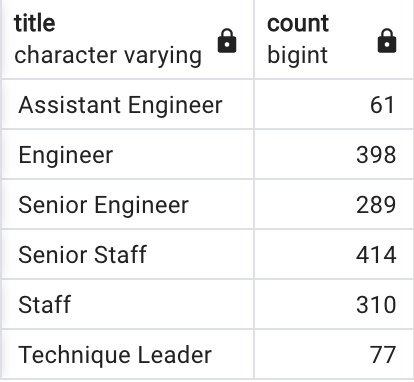

# Pewlett Hackard Analysis
## Overview
The project is based in the data collection of the employees who could serve as tutors for the next generation of workers, as there is a lot of retirement-eligible employees in the close future, the company wants to prepare the welcoming and training of new fellows. By determining the amount of people soon to retirement and retrieveing the contact information from the dataset, the "silver tsunami" could be a more planned strategy.

## Results

To make this first chart, it's needed to filter and sort the data to get how many people with retirement eligibility we are talking about. Filtering on date to check on the employees that could meet certain criteria, evaluating the ones born between 1952 and 1955 and that are still current employees. It can be seen the following: 

Also, from looking at the data it can be collected this two tables: 

Where the facts retrieved from the evaluation of data are:

- A sum total of more than 70,000 employees are eligible or soon for retirement.

- Most of the employees have more than 20 years of experiencie.

- 1549 employees are eligible for mentorship program.

- 

## Summary

How many roles will need to be filled as the "silver tsunami" begins to make an impact?
  
  At least the same ammount soon to retire, which makes ~30% of the personnel. The training program could be done progressively without affecting the economics of the company. 
  
Are there enough qualified, retirement-ready employees in the departments to mentor the next generation of Pewlett Hackard employees?

Using the same queries to retrieve the data and evaluating on different years, 
  (The summary addresses the two questions and contains two additional queries or tables that may provide more insight.)
 

  
  
